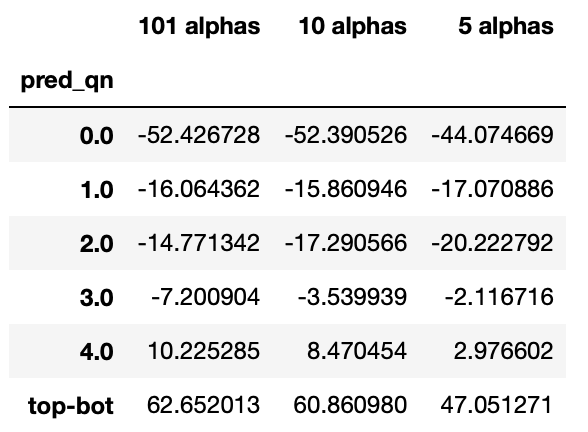

# 101-Formulaic-Alphas
"101 Formulaic Alphas" with xgboost

Target Stocks: Philippine
Period: 8, April, 2020 - 1, April, 2022

Notes:
1. There are about 240 companies in the stock exchange during the period of 08/04/2020 - 01/04/2022. More than half of them have poor liquidity, but about 80 companies are trade everyday.
2. Transaction cost is significant: tax + brokerage ~ 0.3% (sell) and 0.9% (buy). This cost makes this project non-profit by itself. Thus, this is an exercise for ourselves.
3. Why we are interested in this market? These 101 alpha factors are no longer work in the first world markets and the predictive power is significantly reduced after the paper is published. There are not much algorithmic traders in Philippine market, in which the algorithmic trading is not encouraged (high transition fees and taxes during every transaction). Thus, this market is a good exercise for our system.

************************************************************************************

This is our first attempt to test the performance of the alpha factors based on this paper, "101 Formulaic Alphas". The method is as follows.

Step 1: Read in and clean the price data of the stocks in the Philippine market. Then, all the values of 101 alpha factors are calculated.

Step 2: Choose period that we are interested in, which is 08/04/2020 - 01/04/2022 in this note.

Step 3: Remove the poor liquidity stocks.

Step 4: Calculate the "optimsed alpha factor" by using xgboost model, in which the training set is from the N days prior to the test date (N is a human defined window). Here is worth to make a note that the number of the alpha factors for this xgboost model is five, which is a free integer variable. These 5 factors have the biggest feature importance, determined by the SHAP package (https://shap.readthedocs.io/).

Step 5: Calculate the risk matrix from the previous N days.

Step 6: Optimse the objective function: $c_1 \times$ Portfolio_Risk + $c_2 \times$ Transaction_Cost - $c_3 \times$ Predictive_Return + $c_4 \times$ Leverage_Constraint
  * transaction cost: market impact + tax + brokerage.
  * $c_i$ are the free parameters.

Step 7: Move to the next testing date and repeat Steps 4-6.

Part of our results:
  * Testing 5 sets of training parameters.
  * PSEI index (green), return with transaction cost (orange), and return without transaction cost (blue).
  * x-axis is the returns in percentage; y-axis is the date.

*****************************************

Appendix 1: Quantile analysis: this is a brief test at all the 101 $\alpha$ factors. y-axis is the mean returns from each quantile and the unit is the base-point (1E-4).

* 1-day log returns

* 4-days log returns

Appendix 2: The distribution of all the 101 $\alpha$-factors and limit the values within 4-$\sigma$. It is obviously that the distribution is usually non-Gaussian and could be even non-central distributions.

Appendix 3: A brief test of xgboost result, the period of interest is divided into two sets, training (70%) and test (30%) sets
* Features: all the 101 $\alpha$ factors
* Label: 4-days log return

* Features: 10 $\alpha$ factors (feature importance from SHAPLEY)
* Label: 4-days log return

* Features: 5 $\alpha$ factors (feature importance from SHAPLEY)
* Label: 4-days log return

* Prediced returns from 5 $\alpha$-factors of xgboost model with test set (unit is base-point).

Appendix 4: Same as the analysis above but the label is 1-day log return

