# 101-Formulaic-Alphas
"101 Formulaic Alphas" with xgboost

Target Stocks: Philippine
Period: 8, April, 2020 - 1, April, 2022

Notes:
1. There are about 240 companies in the stock exchange during the period of 08/04/2020 - 01/04/2022. More than half of them have poor liquidity, but about 80 companies are trade everyday.
2. Transaction cost is significant: tax + brokerage ~ 0.3 (sell) and 0.9 (buy). This cost makes this project non-profit by itself. Thus, this is an exercise for ourselves.

************************************************************************************

Step 1: Quantile analysis: this is a brief test at all the 101 $\alpha$ factors. y-axis is the mean values (1 and 4 days log returns) from each quantile.

* 1-day log returns

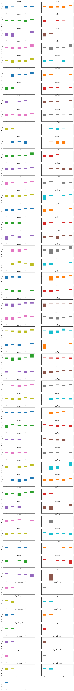

* 4-days log returns

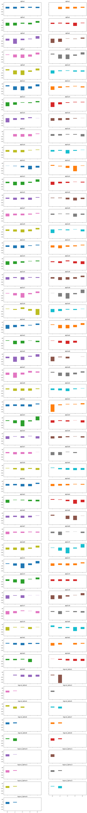

Step 2: Find the distribution of all the 101 $\alpha$ factors and limit the values within 4 $\sigma$

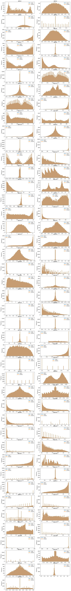

Step 3: test xgboost result with training (70\%) and validation (30\%) sets
* features: all the 101 $\alpha$ factors
* label: 4-days log return

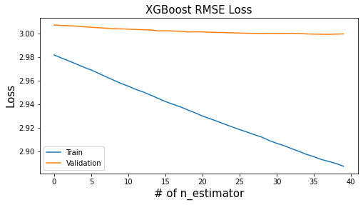

* features: 10 $\alpha$ factors (feature importance from SHAPLEY)
* label: 4-days log return

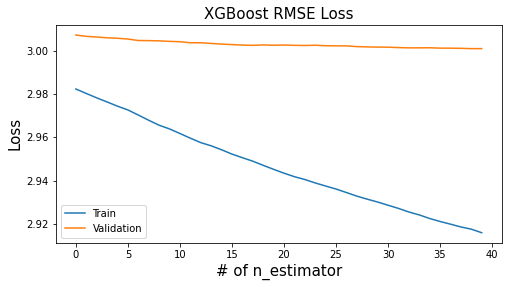

* features: 5 $\alpha$ factors (feature importance from SHAPLEY)
* label: 4-days log return

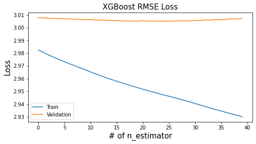

* prediced returns from 5 $\alpha$ factors of xgboost model

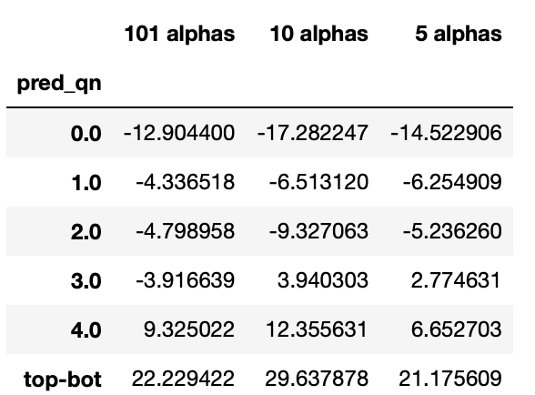

Step 4: test the predicted return by using rolling window 
* using objective function: $c_1 \times$ Portfolio_Risk + $c_2 \times$ Transaction_Cost - $c_3 \times$ Predictive_Return + $c_4 \times$ Leverage_Constraint
  * transaction cost: market impact + tax + brokerage.
* testing 5 sets of training parameters.
  * PSEI index (green), return with transaction cost (orange), and return without transaction cost (blue).

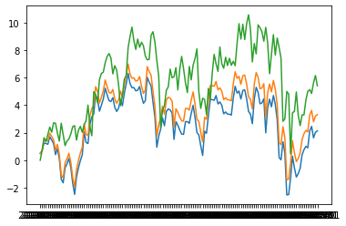
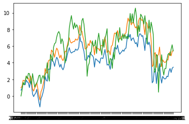
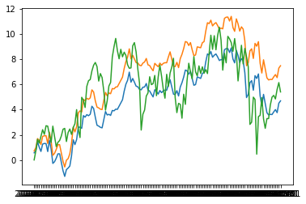
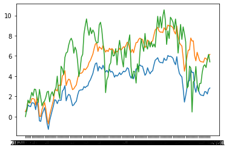
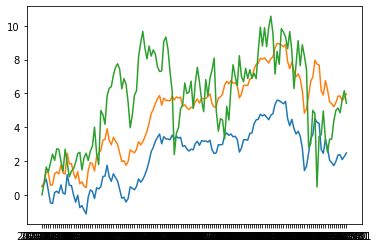

